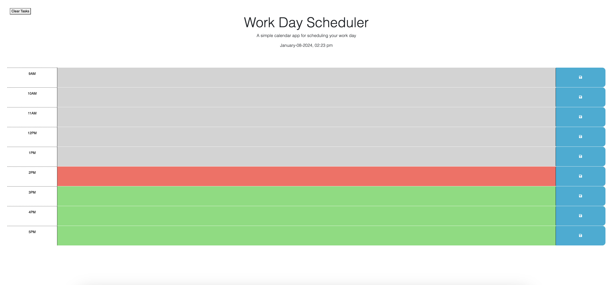
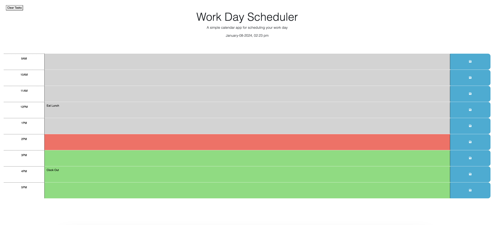

## Day Scheduler

These are the directions given:
- AS AN employee with a busy schedule I WANT to add important events to a daily planner SO THAT I can manage my time effectively

As a result, the day scheduler will have the following attributes:
- WHEN I open the planner THEN the current day is displayed at the top of the calendar
- WHEN I scroll down THEN I am presented with time blocks for standard business hours of 9am to 5pm
- WHEN I view the time blocks for that day THEN each time block is color-coded to indicate whether it is in the past, present, or future
- WHEN I click into a time block THEN I can enter an event
- WHEN I click the save button for that time block THEN the text for that event is saved in local storage
- WHEN I refresh the page THEN the saved events persist

## Starter Code

- Starter Code was given with HTML, CSS and psuedocoding for the javascript.

## HTML

- The HTML given showed thre time blocks for past, present and future. The HTML was edited to remove the past/present/future classes and to show time blocks for 9am to 5pm. 

## Javascript

- Initial code was written to first load the elements of the HTML. 

- Code written to display the current date and time in the header of the page. 

- Page responds to the current time by turning different text boxed gray/red/green respectively. 

- Tasks saved to localStorage when the save button is clicked. If the page is refreshed, the localStorage displays the tasks in the corresponding hour. I added a button to clear all tasks from the text boxes as well as the localStorage. 

- A text box displays saying "Task Stored!" when the save button is pressed. This text only displays for a couple seconds and then refreshes the page and disappears.

## Screenshots

- This first screen shot is empty but shows the active time and color changing blocks according to the time.

- This screenshot shows stored tasks. If the page is refreshed the tasks will stay within the timeslot until the clear button is hit or the tasks are manually removed.

## Installation

- Clone this repository
* $ git clone git@github.com:schneidsmc/day-schedule05.git

## Usage

-Deployed URL

* https://schneidsmc.github.io/day-schedule05/

## Author

* [schneidsmc](https://github.com/schneidsmc)
